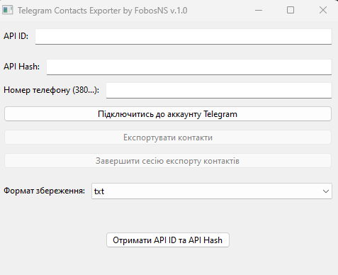

Ця програма, створена на основі wxPython і Telethon, дозволяє користувачам експортувати список контактів зі свого облікового запису Telegram в різні формати (TXT, CSV або VCF). Програма надає графічний інтерфейс для підключення до облікового запису Telegram, отримання контактів і їх збереження в обраному форматі.

Основні можливості:
Підключення до облікового запису Telegram:

Користувачі можуть ввести свій API ID, API Hash і номер телефону, щоб підключитися до свого облікового запису Telegram.
Програма запитує код підтвердження через SMS або додаток Telegram і, при необхідності, пароль хмарної аутентифікації.
Отримання списку контактів:

Після успішного підключення до облікового запису Telegram, програма отримує всі контакти користувача.
Експорт контактів:

Програма дозволяє зберегти список контактів в одному з трьох форматів:
TXT (Текстовий файл)
CSV (Табличний файл, який легко імпортувати в Excel)
VCF (Формат візитних карток, підтримується багатьма додатками для контактів).
Користувач може вибрати формат збереження перед експортом.
Графічний інтерфейс користувача:

Простий і зрозумілий інтерфейс на основі wxPython.
Поля для введення API ID, API Hash і номера телефону.
Розкривний список для вибору формату файлу.
Кнопка для підключення до Telegram і кнопка для завершення сесії.
Кнопка для експорту контактів в обраному форматі.
Інструкція по отриманню API ID та API Hash:

Програма містить кнопку, яка відкриває веб-сторінку для отримання API ID і API Hash на my.telegram.org.
Використання:
Введіть свої API ID, API Hash і номер телефону.
Натисніть кнопку Підключитись до аккаунту Telegram.
Введіть код підтвердження, який ви отримали в Telegram, і пароль (якщо запитується).
Після успішного підключення ви побачите кількість контактів.
Виберіть формат для збереження контактів і натисніть Експортувати контакти.
Виберіть місце для збереження файлу і підтвердіть експорт.
Примітки:
Для використання програми вам потрібні API ID та API Hash, які можна отримати на my.telegram.org.
Програма підтримує кілька форматів збереження контактів для зручності користувача.
